# Roblox Tradefinder

A Discord bot that reads Rolimons trade ads, checks public Roblox inventories, and recommends limited-item exchanges with the calculations and links you need to review and send them yourself.

Every reply is a private, styled Discord embed with buttons. Nothing is posted publicly, the bot never submits trades, and no Roblox password or cookie is ever requested.

<p align="center">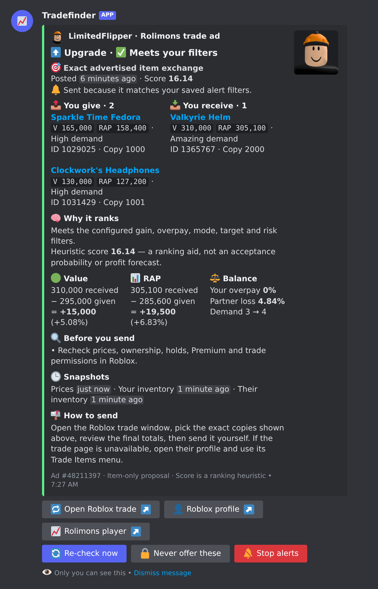</p>

## Features

- **Exact ad matches and generated counteroffers** from the recent Rolimons trade-ad feed, verified against both public inventories down to the unique copy ID.
- **Upgrades, downgrades and swaps** with configurable value gain, RAP gain, overpay, partner-loss, demand, projected-item and ad-age filters.
- **Wanted and locked items**, inventory CSV export, one-off exchange analysis, and opt-in recommendation DMs deduplicated for 24 hours.
- **Interactive UI**: link your account from a form, switch mode and demand with buttons and a select menu, jump between settings, status and inventory panels, re-run a search, re-check a specific exchange, or lock the items a recommendation would give away.
- **Transparent maths**: every card shows the totals, percentages and a heuristic ranking score, plus the caveats.

## Screenshots

Rendered from synthetic data with `npm run screenshots`; they show the real embed and component payloads the bot sends.

| `/trade help` | `/trade settings` |
| --- | --- |
| 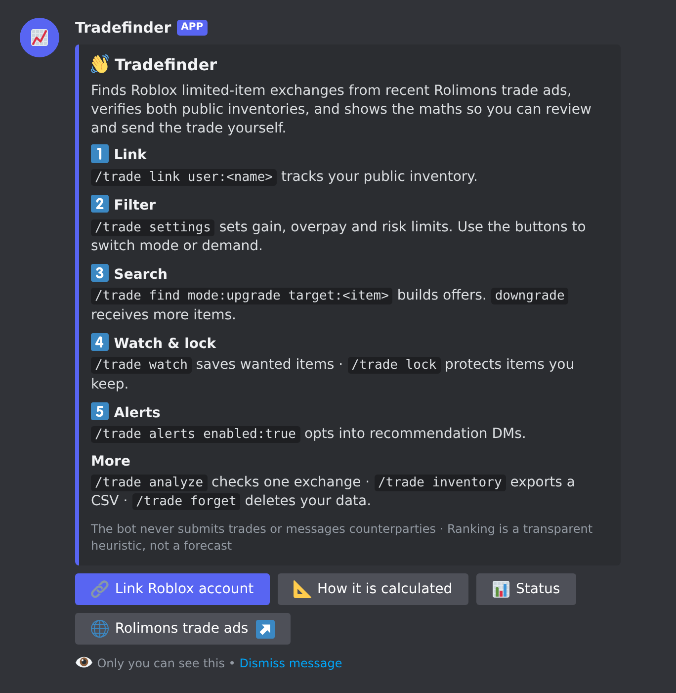 | 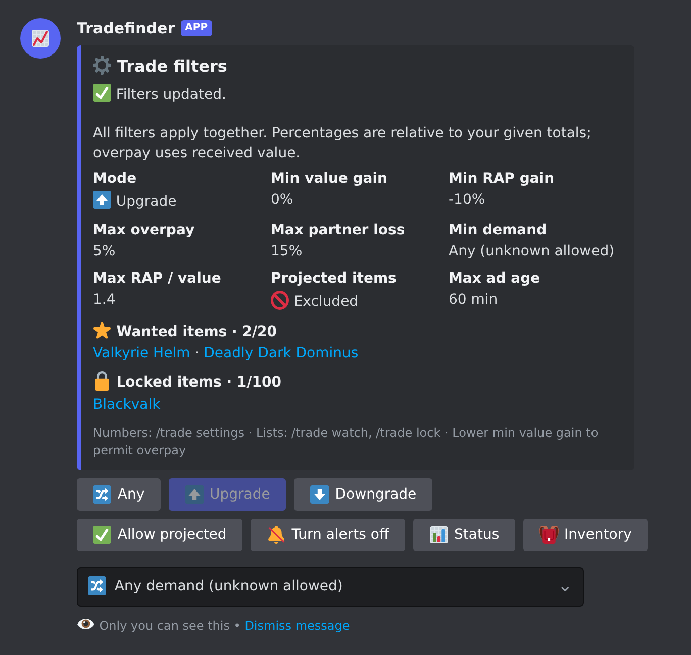 |

| `/trade find` summary | `/trade analyze` (outside filters) |
| --- | --- |
| 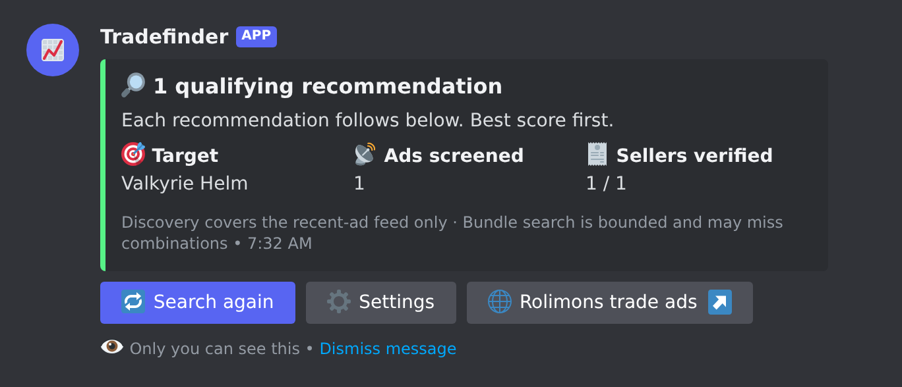 | 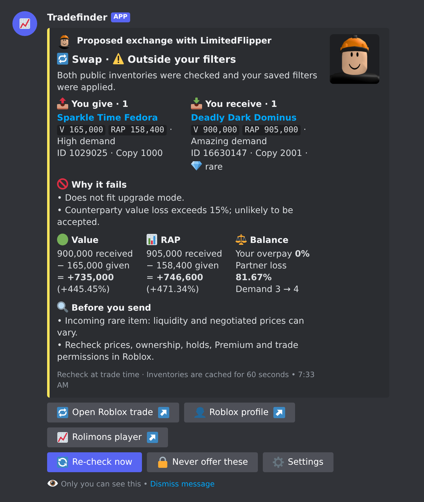 |

| `/trade status` | `/trade inventory` |
| --- | --- |
| 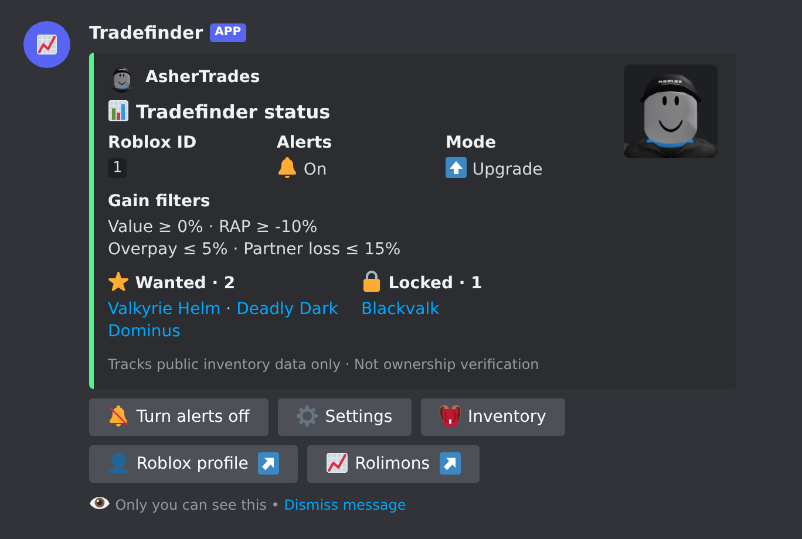 | 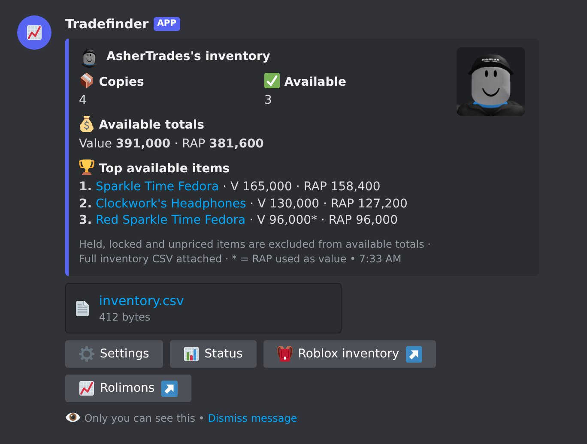 |

| `/trade link` | `/trade alerts` | Calculation guide |
| --- | --- | --- |
| 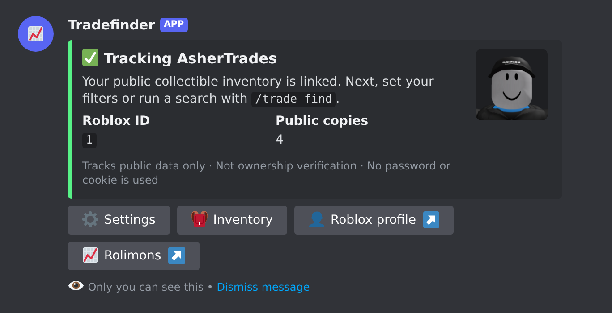 | 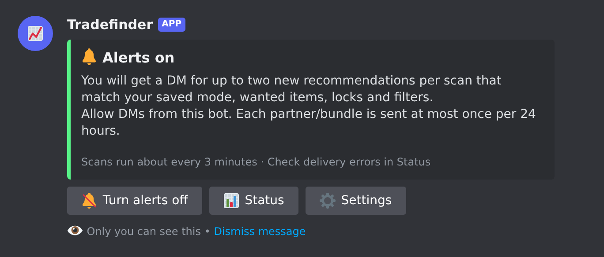 | 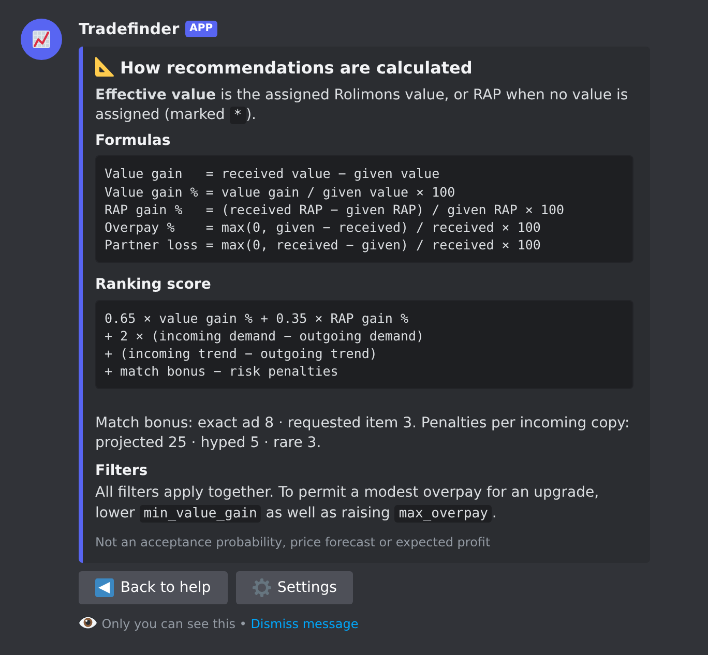 |

Errors and cooldowns are embeds too:

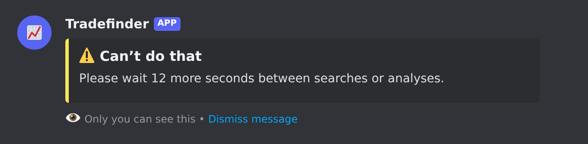

## Run locally

Requires **Node.js 24.17 or newer** and a Discord application.

1. Create an application and bot token in the [Discord Developer Portal](https://discord.com/developers/applications) → your application → Bot. Never share or commit the token.
2. Install and configure:

   ```sh
   npm ci
   cp .env.example .env
   ```

3. Edit `.env`: set `DISCORD_TOKEN` and your application's `DISCORD_CLIENT_ID`. Set `DISCORD_GUILD_ID` to your test server ID for server-scoped command registration. Keep `.env` private.
4. In the Developer Portal's installation settings, enable a **Guild Install** with the `bot` and `applications.commands` scopes. Install in your server. Only the Guilds gateway intent is used; no Message Content or Server Members privileged intents or Administrator permission are needed. The bot uses private command replies and personal DMs.
5. Register and start:

   ```sh
   npm run register
   npm run build
   npm start
   ```

For development use `npm run dev`. With no guild ID, `npm run register` registers global commands; they can take time to propagate. Registration replaces commands in the configured scope, so use a dedicated application. Register again when command definitions change.

The bot process must keep running for alerts. In Discord, run:

```text
/trade link user:YourRobloxUsername
/trade settings min_value_gain:0 min_rap_gain:-10 max_overpay:5
/trade find mode:upgrade target:AnItemAcronym
/trade watch item:AnItemAcronym
/trade alerts enabled:true
```

Make the Roblox inventory public. Linking tracks public data; it is **not ownership verification** and grants no authority over the Roblox account. No Roblox password, cookie or API credential is requested.

## Commands

| Command | Purpose |
| --- | --- |
| `/trade link user` | Track a Roblox username or numeric user ID. Changing accounts resets settings and disables alerts. |
| `/trade inventory` | Available value/RAP totals, top items and full inventory CSV, including hold/lock flags. |
| `/trade find [mode] [target] [results]` | Search recent ads; show up to three recommendations. Target accepts item ID, name or acronym. Overrides apply only to this search. |
| `/trade analyze partner give receive` | Evaluate a specific exchange against both public inventories and your filters. Enter 1–4 comma-separated catalog IDs per side; repeat IDs for multiple copies. |
| `/trade settings` | View saved filters; supply options to update them. |
| `/trade watch item` | Add one of up to 20 wanted items. Searches and alerts must receive at least one wanted item. |
| `/trade unwatch item` | Remove a wanted item, or use `all`. An empty wanted list accepts any item. |
| `/trade lock item` | Exclude every copy of an item from outgoing proposals. Up to 100 item IDs. |
| `/trade unlock item` | Remove a lock, or use `all`. |
| `/trade alerts enabled` | Explicitly opt in/out of recommendation DMs under saved preferences. |
| `/trade status` | Account, filters and last alert error. |
| `/trade forget` | Delete your account mapping, preferences and alert history; stop alerts. |
| `/trade help` | Short usage and calculation guide. |

## Interactive UI

Every reply is a private embed with buttons. Recommendation cards carry **Open Roblox trade**, **Roblox profile** and **Rolimons player** links plus **Re-check now** (re-evaluates that exact exchange against fresh inventories), **Never offer these** (locks the given items) and, on alert DMs, **Stop alerts**. Settings, status and inventory panels link to each other; the settings panel switches mode and projected-item handling with buttons and minimum demand with a select menu. The help panel opens a **Link Roblox account** form. Search summaries have a **Search again** button that reuses the same mode, target and result count.

**Upgrade:** give more copies than you receive, including multiple items for one. **Downgrade:** receive more copies than you give, including one item for multiple. Equal counts are swaps. Counts refer to unique owned copies, not distinct catalog IDs. Roblox item exchanges are limited to four copies on each side.

## Calculations and filters

For each item, **effective value** is assigned Rolimons value, falling back to Rolimons RAP when no value is assigned. The UI marks RAP fallbacks with `*`. This is not the catalog purchase price or a cash valuation.

```text
Value gain     = total received effective value − total given effective value
Value gain %   = value gain / total given effective value × 100
RAP gain       = total received RAP − total given RAP
RAP gain %     = RAP gain / total given RAP × 100
Your overpay % = max(0, given value − received value) / received value × 100
Partner loss % = max(0, received value − given value) / received value × 100
```

All filters apply together. Defaults:

| Setting | Default | Meaning |
| --- | --- | --- |
| `mode` | `any` | Upgrade, downgrade or any |
| `min_value_gain` | `0` | Minimum value gain percentage |
| `min_rap_gain` | `-10` | Maximum 10% RAP loss |
| `max_overpay` | `5` | Maximum overpay relative to received value |
| `max_partner_loss` | `15` | Avoid proposing extreme value losses to the seller |
| `min_demand` | `-1` | Permit unknown demand; 0–4 = terrible, low, normal, high, amazing |
| `max_rap_value_ratio` | `1.4` | Incoming RAP / assigned value cap; not applied to RAP-only items |
| `exclude_projected` | `true` | Reject incoming projected items |
| `max_ad_age` | `60` | Maximum ad age in minutes |

To allow a modest overpay for an upgrade, lower `min_value_gain` as well as increasing `max_overpay`. For example, `min_value_gain:-5 max_overpay:6` permits giving 100 value for 95 received; `min_value_gain:0` would reject it regardless of the overpay setting. Watch lists and locked items are also enforced by `/trade analyze`.

Only passing candidates are ranked. The transparent **heuristic score** is:

```text
0.65 × value gain % + 0.35 × RAP gain %
+ 2 × (incoming weighted demand − outgoing weighted demand)
+ (incoming weighted trend − outgoing weighted trend)
+ match bonus − incoming risk penalties
```

Demand and trend averages are weighted by effective value. Unknown demand scores as 0; unknown trend is neutral. Trend scores: lowering −1, unstable −0.5, stable 0, raising +1, fluctuating −0.5. Match bonus is 8 for an exact advertised exchange, 3 for a counteroffer including a requested item, otherwise 0. Incoming penalties per copy: projected 25, hyped 5, rare 3. Unknown attributes, RAP fallback and flagged items are disclosed.

The score ranks current snapshots. It is **not a statistically calibrated probability**, price forecast, historical volatility analysis, acceptance guarantee or expected profit. RAP and effective value are correlated, especially for unvalued items. The available endpoints do not supply the price history or accepted-trade dataset needed to claim those models.

## Discovery, verification and alerts

- Uses the [Rolimons item and recent-ad endpoints](https://github.com/maddoxbouldin/Rolimons-API) from the supplied Lua wrapper, accessed directly with a typed HTTP adapter. No Lua runtime is required. Inventories come from [Roblox's public inventory API](https://inventory.roblox.com/docs/index.html); the restricted Rolimons player endpoint is not used.
- Reads recent ads, filters for wanted items, and generates item bundles. Exact exchanges require the full requested multiset and full offered multiset. Partial matches are clearly labeled counteroffers. Seller upgrading/downgrading tags are interpreted from the seller's perspective.
- Checks complete paginated inventories for you and shortlisted sellers. Uses unique user-asset IDs, excludes holds, respects duplicate quantities and locks, and skips unpriced assets. If an advertised copy is missing, that ad is discarded. Private/blocked inventories never become verified recommendations.
- Discovery covers **recent advertisers**, not every owner on Roblox. It does not scrape hidden inventories or enumerate the world's owners. Item-only proposals are supported; ads involving Robux are skipped because their cash component and fees would change the calculation. Coverage is limited to assets present in the returned Rolimons catalog and Roblox inventory endpoint; unsupported collectibles are omitted from trading suggestions.
- Maximum 12 seller inventories per search by default. All eligible ads are price-screened first; the best candidate sellers are verified. Large outgoing inventories use a 28-copy sample spanning requested items and price points; up to four copies per asset are useful. Exact requested bundles still use the full inventory. For each advertised subset, up to 160 eligible outgoing bundles are sampled. This bounded search may miss deals and is not an exhaustive optimizer.
- Price cache: 120 seconds; recent ads: 30 seconds; inventories: 60 seconds. No stale-on-error fallback. Results over five minutes old are rejected. An inventory pagination limit of 100 pages (10,000 copies) fails explicitly instead of returning a partial inventory. Snapshots cannot be atomic across pages or accounts; recheck at trade time.
- The monitor runs every 180 seconds **after the previous scan finishes**, sharing API caches and spacing requests by host. It sends up to two new recommendations per subscriber per cycle. Each recipient/partner/item-bundle combination is suppressed for 24 hours, including reposted ads, and persists across restarts. Failed sends are not marked delivered. A crash between Discord delivery and writing its receipt can cause one duplicate on restart.
- DMs require opt-in. Blocked DMs disable alerts and leave an explanation in `/trade status`; transient failures retry later. Preferences are rechecked before delivery. Manual searches are limited to one per user per 30 seconds. A single bot process should use the database; horizontal multi-process coordination is not implemented.
- Each recommendation supplies copy IDs, prices, value/RAP totals and percentage changes, risk notes, timestamps, partner links and manual trading guidance. The bot does not submit trades, impersonate users or message counterparties. Premium status and trading permissions are checked by the user in Roblox.

## Validation

```sh
npm run check  # TypeScript build and offline tests
npm run demo   # Synthetic recommendation; writes data/demo-recommendation.json
npm run smoke  # Read-only live items, ads and a public advertiser inventory
npm run screenshots  # Re-render docs/screenshots/*.png (needs Python Playwright with Chromium)
```

For a specific live inventory: `SMOKE_ROBLOX_ID=123 npm run smoke`. Live smoke checks can fail if the selected inventory is private or services rate limit requests. Tests cover calculations, quantity checks, risk filters, generation, tags, pagination, API schema errors, rate limits, concurrency, persistent settings, alert deduplication and delivery failures. No Discord token is needed for tests or demo. Actual Discord registration, login, rendering and DM delivery need real credentials and an installed bot.

## Container deployment

First register commands locally as above, then:

```sh
docker compose up -d --build
docker compose logs -f bot
```

The container runs as a non-root user with a persistent SQLite volume. `.env` and database files are excluded from the image and Git. No public HTTP port is needed. Back up the `bot-data` volume. Stop the bot before copying the database or use a SQLite-aware backup that includes its WAL state.

The project has no hosted deployment configured. Keep the process running on your own machine or a host with outbound access to Discord, Rolimons and Roblox. Cache and rate limits reduce API traffic but cannot eliminate upstream access restrictions.

## Code layout

`providers.ts` validates upstream schemas, inventories and avatar lookups; `engine.ts` calculates and constructs exchanges; `search.ts` handles discovery and seller verification; `store.ts` persists profiles; `monitor.ts` delivers opt-in alerts; `commands.ts` defines the slash command, `bot.ts` handles commands, buttons, select menus and modals, and `presentation.ts` builds every embed and component. `scripts/screenshots.ts` renders those payloads to Discord-styled HTML for the README. `index.ts` starts the service and `register.ts` registers slash commands.
